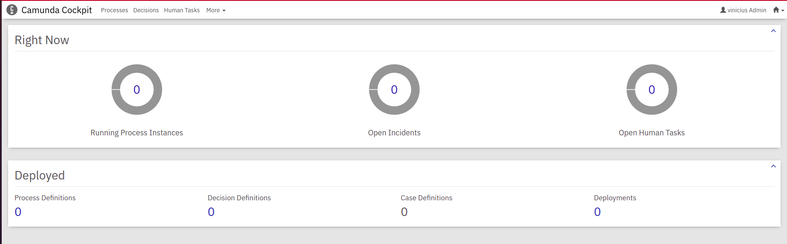
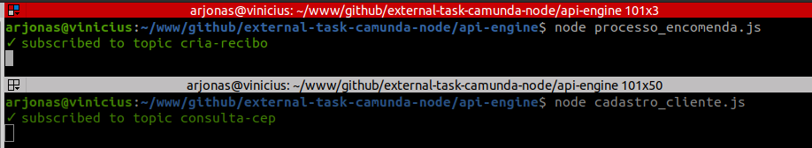
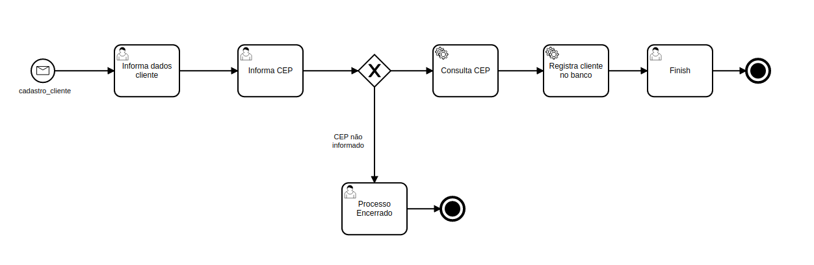
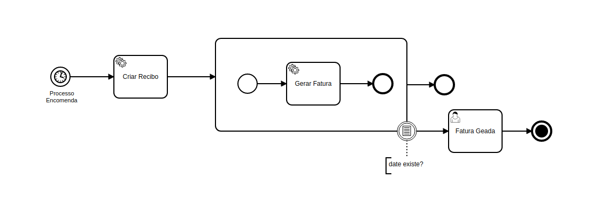

# External task camunda node

## Objetivo

Projeto desenvolvido utilizando node para desenvolver uma external task client que se comunica com a engine atráves de uma tarefa de serviço da modelagem, que ao ser chamada, faz a integração com um microserviço REST.

## Tecnologias Utilizadas

As seguintes ferramentas foram usadas na construção do projeto:

- [Node JS](https://nodejs.org/en/)
- [Docker](https://google.com)
- [Camunda](https://docs.camunda.org/manual/7.16/)


## Pré requisitos

Ter instalado na sua máquina uma versão do Java, Node, docker, docker-compose e o camunda modeler.

- Java Runtime Environment 1.8+
- Node Latest
- Docker
- Docker Compose
- Camunda Modeler

## Como rodar a aplicação

1 - Execute os comandos abaixo no seu terminal para levantar a engine do cockipit, utilizando o docker.

```sh
docker pull camunda/camunda-bpm-platform:run-latest
docker run -d --name camunda -p 8080:8080 camunda/camunda-bpm-platform:run-latest
```

Após rodar os comandos, acima acesse a URL: http://localhost:8080 e informe o usuário e senha: demo, para acessar o cockipit, como na imagem abaixo:




2 - Acesse o diretório "api-engine" atraves do seu terminal bash e digite o comando abaixo, para instalar as dependências da aplicação:
```sh
npm isntall
```

E depois inicie a aplicação, se escrevendo nos tópico de cadatro de cliente e processo de encomenda. Para fazer isso abra duas abas do terminal e digite os comandos igual na figura abaixo:



3 - Importe a collection do postman que está na pasta "files" na raiz do projeto e faça o teste fazendo deployment do BPMN, iniciando um processo e completando uma tarefa.


## Modelagem do BPMN - Cadastro Cliente



## Modelagem do BPMN - Processo de Encomenda


